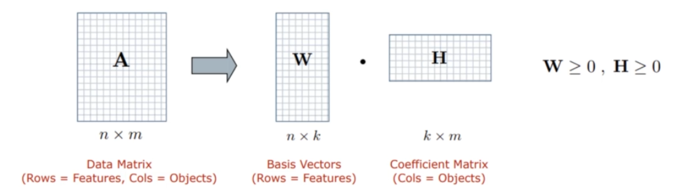
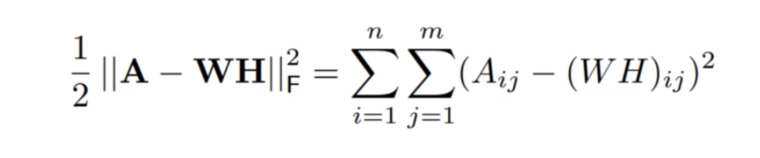
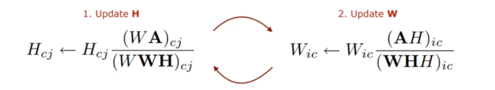
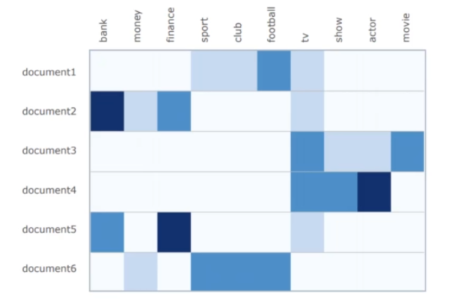
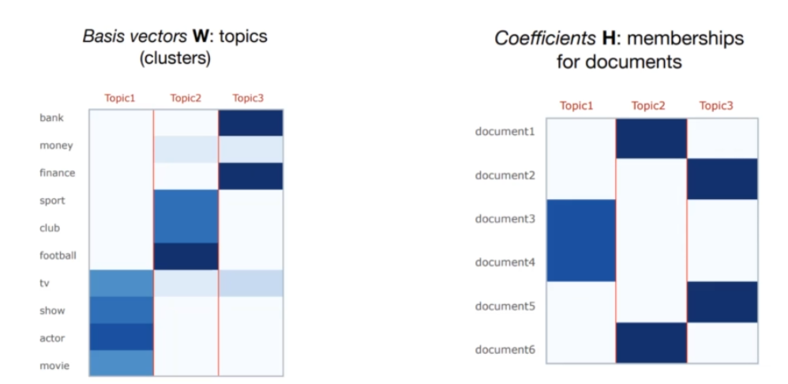

# Topic Modelling Using Latent Dirichlet Allocation

## What does LDA do ?
It represents documents as mixture of topics that spits out words with certain probabilities.
It assumes that documents are produced in the following fashion:
- Choose a topic mixture for the document over K fixed topics.
- First picking a topic according to the multinomial distribution that we sampled previously

### Generate each word in the topic 
- Using the topic to generate the word itself.
- Example if the topic is 'food' the probability of generating the word 'apple' is more than 'home'.

#### LDA then tries to backtrack from these words to topics that might have created these collection of words 


## Assumptions for LDA(Latent Dirichlet Allocation) in Topic Modelling
- Documents are probability distribution over latent topics.
- Topics themselves are probability distribution over latent words.

## Steps to how LDA executed
- We iterate through every document and assign each word in it to a particular K topic that we defined before.
- This random assignment gives us topic representation and word distribution of every topic.
- We iterate over every word in every topic and calculate t 
    p( t topic|d document) - the proportion of words assigned to each topic in every document d .
- We iterate over every word in every topic and calculate t :
    p(w word|d document) - the proportion of assignments to each topic in every document that comes from the word w.  
- Reassign w to new topic with probability p(t topic|d document) * p(w word|t topic).
- This is basically that topic t  generated the word w.
- At the end we have the words with highest probability of being assigned topic. 

## Imorting basic libraries


```python
import pandas as pd
npr_csv = pd.read_csv('npr.csv')
```


```python
npr_csv.head()
```


<div>
<style scoped>
    .dataframe tbody tr th:only-of-type {
        vertical-align: middle;
    }

    .dataframe tbody tr th {
        vertical-align: top;
    }

    .dataframe thead th {
        text-align: right;
    }
</style>
<table border="1" class="dataframe">
  <thead>
    <tr style="text-align: right;">
      <th></th>
      <th>Article</th>
    </tr>
  </thead>
  <tbody>
    <tr>
      <th>0</th>
      <td>In the Washington of 2016, even when the polic...</td>
    </tr>
    <tr>
      <th>1</th>
      <td>Donald Trump has used Twitter  —   his prefe...</td>
    </tr>
    <tr>
      <th>2</th>
      <td>Donald Trump is unabashedly praising Russian...</td>
    </tr>
    <tr>
      <th>3</th>
      <td>Updated at 2:50 p. m. ET, Russian President Vl...</td>
    </tr>
    <tr>
      <th>4</th>
      <td>From photography, illustration and video, to d...</td>
    </tr>
  </tbody>
</table>
</div>


## Our Articles consist of different types of articles


```python
from sklearn.feature_extraction.text import CountVectorizer
```

max_df gets rid of terms that are common in lot of documents(90%)<br>
min_df minimum document frequency of word to be counted in atleast 2 documents<br>
to remove stop words 'stop_words = "english"'


```python
cv = CountVectorizer(max_df = 0.9, min_df = 2, stop_words="english")
```

To calculate the document term frequency


```python
dtm = cv.fit_transform(npr_csv['Article'])
```

Importing our LDA Library


```python
from sklearn.decomposition import LatentDirichletAllocation
```


```python
LDA = LatentDirichletAllocation(n_components= 7, random_state=42)
```


```python
LDA.fit(dtm)
```


    LatentDirichletAllocation(batch_size=128, doc_topic_prior=None,
                 evaluate_every=-1, learning_decay=0.7,
                 learning_method='batch', learning_offset=10.0,
                 max_doc_update_iter=100, max_iter=10, mean_change_tol=0.001,
                 n_components=7, n_jobs=None, n_topics=None, perp_tol=0.1,
                 random_state=42, topic_word_prior=None,
                 total_samples=1000000.0, verbose=0)


### These are all the words in our LDA


```python
len(cv.get_feature_names())
```


    54777


### Extracting the top 15 words from each topic 


```python
import numpy as np
```


```python
for index,topic in enumerate(LDA.components_):
    print(f'The top 15 words for topic #{index}')
    print([cv.get_feature_names()[index] for index in topic.argsort()[-15:]])
    print('\n')
    print('\n')
```

    The top 15 words for topic #0
    ['companies', 'money', 'year', 'federal', '000', 'new', 'percent', 'government', 'company', 'million', 'care', 'people', 'health', 'said', 'says']
    
    
    
    
    The top 15 words for topic #1
    ['military', 'house', 'security', 'russia', 'government', 'npr', 'reports', 'says', 'news', 'people', 'told', 'police', 'president', 'trump', 'said']
    
    
    
    
    The top 15 words for topic #2
    ['way', 'world', 'family', 'home', 'day', 'time', 'water', 'city', 'new', 'years', 'food', 'just', 'people', 'like', 'says']
    
    
    
    
    The top 15 words for topic #3
    ['time', 'new', 'don', 'years', 'medical', 'disease', 'patients', 'just', 'children', 'study', 'like', 'women', 'health', 'people', 'says']
    
    
    
    
    The top 15 words for topic #4
    ['voters', 'vote', 'election', 'party', 'new', 'obama', 'court', 'republican', 'campaign', 'people', 'state', 'president', 'clinton', 'said', 'trump']
    
    
    
    
    The top 15 words for topic #5
    ['years', 'going', 've', 'life', 'don', 'new', 'way', 'music', 'really', 'time', 'know', 'think', 'people', 'just', 'like']
    
    
    
    
    The top 15 words for topic #6
    ['student', 'years', 'data', 'science', 'university', 'people', 'time', 'schools', 'just', 'education', 'new', 'like', 'students', 'school', 'says']
    
    
    
    


```python
topic_results = LDA.transform(dtm)
```


```python
npr_csv['Topic'] = topic_results.argmax(axis= 1)
```


```python
npr_csv
```


<div>
<style scoped>
    .dataframe tbody tr th:only-of-type {
        vertical-align: middle;
    }

    .dataframe tbody tr th {
        vertical-align: top;
    }

    .dataframe thead th {
        text-align: right;
    }
</style>
<table border="1" class="dataframe">
  <thead>
    <tr style="text-align: right;">
      <th></th>
      <th>Article</th>
      <th>Topic</th>
    </tr>
  </thead>
  <tbody>
    <tr>
      <th>0</th>
      <td>In the Washington of 2016, even when the polic...</td>
      <td>1</td>
    </tr>
    <tr>
      <th>1</th>
      <td>Donald Trump has used Twitter  —   his prefe...</td>
      <td>1</td>
    </tr>
    <tr>
      <th>2</th>
      <td>Donald Trump is unabashedly praising Russian...</td>
      <td>1</td>
    </tr>
    <tr>
      <th>3</th>
      <td>Updated at 2:50 p. m. ET, Russian President Vl...</td>
      <td>1</td>
    </tr>
    <tr>
      <th>4</th>
      <td>From photography, illustration and video, to d...</td>
      <td>2</td>
    </tr>
    <tr>
      <th>5</th>
      <td>I did not want to join yoga class. I hated tho...</td>
      <td>3</td>
    </tr>
    <tr>
      <th>6</th>
      <td>With a   who has publicly supported the debunk...</td>
      <td>3</td>
    </tr>
    <tr>
      <th>7</th>
      <td>I was standing by the airport exit, debating w...</td>
      <td>2</td>
    </tr>
    <tr>
      <th>8</th>
      <td>If movies were trying to be more realistic, pe...</td>
      <td>3</td>
    </tr>
    <tr>
      <th>9</th>
      <td>Eighteen years ago, on New Year’s Eve, David F...</td>
      <td>2</td>
    </tr>
    <tr>
      <th>10</th>
      <td>For years now, some of the best, wildest, most...</td>
      <td>5</td>
    </tr>
    <tr>
      <th>11</th>
      <td>For years now, some of the best, wildest, most...</td>
      <td>5</td>
    </tr>
    <tr>
      <th>12</th>
      <td>The Colorado River is like a giant bank accoun...</td>
      <td>2</td>
    </tr>
    <tr>
      <th>13</th>
      <td>For the last installment of NPR’s holiday reci...</td>
      <td>2</td>
    </tr>
    <tr>
      <th>14</th>
      <td>Being overweight can raise your blood pressure...</td>
      <td>3</td>
    </tr>
    <tr>
      <th>15</th>
      <td>Who’s the YouTube star of 2016? Adele singing ...</td>
      <td>5</td>
    </tr>
    <tr>
      <th>16</th>
      <td>Here’s a quick roundup of some of the   you ma...</td>
      <td>2</td>
    </tr>
    <tr>
      <th>17</th>
      <td>Ben Johnston doesn’t follow the rules of music...</td>
      <td>5</td>
    </tr>
    <tr>
      <th>18</th>
      <td>David Bowie, Prince and George Michael are all...</td>
      <td>5</td>
    </tr>
    <tr>
      <th>19</th>
      <td>In November, the typically straitlaced Office ...</td>
      <td>1</td>
    </tr>
    <tr>
      <th>20</th>
      <td>This is the time of year when everybody is mak...</td>
      <td>5</td>
    </tr>
    <tr>
      <th>21</th>
      <td>Terrorist attacks, hurricanes, a divisive U. S...</td>
      <td>6</td>
    </tr>
    <tr>
      <th>22</th>
      <td>We all experience stress at work, no matter th...</td>
      <td>6</td>
    </tr>
    <tr>
      <th>23</th>
      <td>When John Fahey recorded The New Possibility i...</td>
      <td>5</td>
    </tr>
    <tr>
      <th>24</th>
      <td>This year was one of   hacks, exploding smartp...</td>
      <td>6</td>
    </tr>
    <tr>
      <th>25</th>
      <td>From West Virginia to Wyoming, coal country ov...</td>
      <td>4</td>
    </tr>
    <tr>
      <th>26</th>
      <td>Updated Jan. 1 at 9:56 a. m. ET, At least 39 p...</td>
      <td>1</td>
    </tr>
    <tr>
      <th>27</th>
      <td>On the morning of Jan. 1, Los Angeles resident...</td>
      <td>1</td>
    </tr>
    <tr>
      <th>28</th>
      <td>In September, reproductive endocrinologist Joh...</td>
      <td>3</td>
    </tr>
    <tr>
      <th>29</th>
      <td>In an effort to take advantage of the intimate...</td>
      <td>3</td>
    </tr>
    <tr>
      <th>...</th>
      <td>...</td>
      <td>...</td>
    </tr>
    <tr>
      <th>11962</th>
      <td>Updated at 6:15 p. m. The White House has anno...</td>
      <td>1</td>
    </tr>
    <tr>
      <th>11963</th>
      <td>The actress Debbie Reynolds’ death just one da...</td>
      <td>3</td>
    </tr>
    <tr>
      <th>11964</th>
      <td>Here’s a timely reminder for all you   reveler...</td>
      <td>6</td>
    </tr>
    <tr>
      <th>11965</th>
      <td>Every year in late November, the New Mexican v...</td>
      <td>2</td>
    </tr>
    <tr>
      <th>11966</th>
      <td>Time to get together the transcripts and the t...</td>
      <td>6</td>
    </tr>
    <tr>
      <th>11967</th>
      <td>Hollywood is in the process of closing out a  ...</td>
      <td>5</td>
    </tr>
    <tr>
      <th>11968</th>
      <td>Dealing with a flood of   pardon requests amou...</td>
      <td>1</td>
    </tr>
    <tr>
      <th>11969</th>
      <td>Rashaan Salaam, the former college football st...</td>
      <td>3</td>
    </tr>
    <tr>
      <th>11970</th>
      <td>On the top of Hawaii’s Mauna Kea mountain Thur...</td>
      <td>6</td>
    </tr>
    <tr>
      <th>11971</th>
      <td>A tiny pink peanut is not a white rhinoceros. ...</td>
      <td>2</td>
    </tr>
    <tr>
      <th>11972</th>
      <td>In a disappointment to Alzheimer’s patients an...</td>
      <td>3</td>
    </tr>
    <tr>
      <th>11973</th>
      <td>In my early 20s, smitten by the mythic underpi...</td>
      <td>5</td>
    </tr>
    <tr>
      <th>11974</th>
      <td>It’s been a lively year for social media maven...</td>
      <td>1</td>
    </tr>
    <tr>
      <th>11975</th>
      <td>This is not a review. It started out as one: I...</td>
      <td>5</td>
    </tr>
    <tr>
      <th>11976</th>
      <td>On a summer’s day in December, a warehouse in ...</td>
      <td>2</td>
    </tr>
    <tr>
      <th>11977</th>
      <td>Elections aren’t exactly cozy, even in the bes...</td>
      <td>5</td>
    </tr>
    <tr>
      <th>11978</th>
      <td>Although her oldest child, Ben, is 10 years ol...</td>
      <td>3</td>
    </tr>
    <tr>
      <th>11979</th>
      <td>When a political scandal explodes in France, t...</td>
      <td>1</td>
    </tr>
    <tr>
      <th>11980</th>
      <td>The darkest moment for American police this ye...</td>
      <td>4</td>
    </tr>
    <tr>
      <th>11981</th>
      <td>Russia was ordered to vacate two compounds it ...</td>
      <td>2</td>
    </tr>
    <tr>
      <th>11982</th>
      <td>A North Carolina judge is temporarily blocking...</td>
      <td>4</td>
    </tr>
    <tr>
      <th>11983</th>
      <td>China’s police are under fire this week as cit...</td>
      <td>1</td>
    </tr>
    <tr>
      <th>11984</th>
      <td>Before the virus overwhelmed Puerto Rico, Zika...</td>
      <td>3</td>
    </tr>
    <tr>
      <th>11985</th>
      <td>It seems everything today has a flavor wheel, ...</td>
      <td>2</td>
    </tr>
    <tr>
      <th>11986</th>
      <td>In the final days of a year that has become kn...</td>
      <td>2</td>
    </tr>
    <tr>
      <th>11987</th>
      <td>The number of law enforcement officers shot an...</td>
      <td>1</td>
    </tr>
    <tr>
      <th>11988</th>
      <td>Trump is busy these days with victory tours,...</td>
      <td>4</td>
    </tr>
    <tr>
      <th>11989</th>
      <td>It’s always interesting for the Goats and Soda...</td>
      <td>3</td>
    </tr>
    <tr>
      <th>11990</th>
      <td>The election of Donald Trump was a surprise to...</td>
      <td>4</td>
    </tr>
    <tr>
      <th>11991</th>
      <td>Voters in the English city of Sunderland did s...</td>
      <td>0</td>
    </tr>
  </tbody>
</table>
<p>11992 rows × 2 columns</p>
</div>


# Non Negative Matrix Factorization
- NNMF is an unsupervised learning algroithm that performs dimensionality reduction and clustering at the same time
- We will use TD-IDF in conjuction to our algorithm model topics accross document

## General idea behinf NNMF
- We've been given a non negative matrix of a containing our features A(Term Document Matrix), find K approximation vectors in terms of non-neagtive factors W(Basic Vectors) and H(Coefficient Matrix).

### Note :
- Basic Vetors: The topics(clusters) in the data.
- Coefficient Matrix : The membership weights for documents relative to each topic.



- Basically we are going to approximate that multiplication of W and H would be equal to our matrix A. For that we will calculate the objective function.



- Expectation maximization optimization to refine W and H in order to minimise the values of objective function



### So we'll create a Term Document Matrix with TF-IDF Vectorization



### Achieving our final result




## In order to implement it we'll follow the same steps as in LDA


```python
import pandas as pd
```


```python
npr_csv = pd.read_csv('npr.csv')
```


```python
from sklearn.feature_extraction.text import TfidfVectorizer
```


```python
tfid = TfidfVectorizer(max_df= 0.95, min_df= 2, stop_words= 'english')
```


```python
dtm = tfid.fit_transform(npr_csv['Article'])
```


```python
from sklearn.decomposition import NMF
```


```python
nfm_model = NMF(n_components= 7, random_state=42)
```


```python
nfm_model.fit(dtm)
```


    NMF(alpha=0.0, beta_loss='frobenius', init=None, l1_ratio=0.0, max_iter=200,
      n_components=7, random_state=42, shuffle=False, solver='cd', tol=0.0001,
      verbose=0)


```python
for i,topic in enumerate(nfm_model.components_):
    print(f"The top 15 words from Topic #{i}")
    print([tfid.get_feature_names()[i] for i in topic.argsort()[-15:]])
    print('\n')
    
```

    The top 15 words from Topic #0
    ['new', 'research', 'like', 'patients', 'health', 'disease', 'percent', 'women', 'virus', 'study', 'water', 'food', 'people', 'zika', 'says']
    
    
    The top 15 words from Topic #1
    ['gop', 'pence', 'presidential', 'russia', 'administration', 'election', 'republican', 'obama', 'white', 'house', 'donald', 'campaign', 'said', 'president', 'trump']
    
    
    The top 15 words from Topic #2
    ['senate', 'house', 'people', 'act', 'law', 'tax', 'plan', 'republicans', 'affordable', 'obamacare', 'coverage', 'medicaid', 'insurance', 'care', 'health']
    
    
    The top 15 words from Topic #3
    ['officers', 'syria', 'security', 'department', 'law', 'isis', 'russia', 'government', 'state', 'attack', 'president', 'reports', 'court', 'said', 'police']
    
    
    The top 15 words from Topic #4
    ['primary', 'cruz', 'election', 'democrats', 'percent', 'party', 'delegates', 'vote', 'state', 'democratic', 'hillary', 'campaign', 'voters', 'sanders', 'clinton']
    
    
    The top 15 words from Topic #5
    ['love', 've', 'don', 'album', 'way', 'time', 'song', 'life', 'really', 'know', 'people', 'think', 'just', 'music', 'like']
    
    
    The top 15 words from Topic #6
    ['teacher', 'state', 'high', 'says', 'parents', 'devos', 'children', 'college', 'kids', 'teachers', 'student', 'education', 'schools', 'school', 'students']
    
    


```python
topic_results = nfm_model.transform(dtm)
```


```python
npr_csv['Topic']  = topic_results.argmax(axis=1)
```


```python
npr_csv.head()
```


<div>
<style scoped>
    .dataframe tbody tr th:only-of-type {
        vertical-align: middle;
    }

    .dataframe tbody tr th {
        vertical-align: top;
    }

    .dataframe thead th {
        text-align: right;
    }
</style>
<table border="1" class="dataframe">
  <thead>
    <tr style="text-align: right;">
      <th></th>
      <th>Article</th>
      <th>Topic</th>
    </tr>
  </thead>
  <tbody>
    <tr>
      <th>0</th>
      <td>In the Washington of 2016, even when the polic...</td>
      <td>1</td>
    </tr>
    <tr>
      <th>1</th>
      <td>Donald Trump has used Twitter  —   his prefe...</td>
      <td>1</td>
    </tr>
    <tr>
      <th>2</th>
      <td>Donald Trump is unabashedly praising Russian...</td>
      <td>1</td>
    </tr>
    <tr>
      <th>3</th>
      <td>Updated at 2:50 p. m. ET, Russian President Vl...</td>
      <td>3</td>
    </tr>
    <tr>
      <th>4</th>
      <td>From photography, illustration and video, to d...</td>
      <td>6</td>
    </tr>
  </tbody>
</table>
</div>


## Labeling our topics


```python
my_topic_dict = {0 : 'Health', 1:'Election', 2: 'Legislation',3:'Politics', 4: 'Election', 5: 'Music',6: 'Education' }
npr_csv['Topic Label'] = npr_csv['Topic'].map(my_topic_dict)
```


```python
npr_csv[0:10]
```


<div>
<style scoped>
    .dataframe tbody tr th:only-of-type {
        vertical-align: middle;
    }

    .dataframe tbody tr th {
        vertical-align: top;
    }

    .dataframe thead th {
        text-align: right;
    }
</style>
<table border="1" class="dataframe">
  <thead>
    <tr style="text-align: right;">
      <th></th>
      <th>Article</th>
      <th>Topic</th>
      <th>Topic Label</th>
    </tr>
  </thead>
  <tbody>
    <tr>
      <th>0</th>
      <td>In the Washington of 2016, even when the polic...</td>
      <td>1</td>
      <td>Election</td>
    </tr>
    <tr>
      <th>1</th>
      <td>Donald Trump has used Twitter  —   his prefe...</td>
      <td>1</td>
      <td>Election</td>
    </tr>
    <tr>
      <th>2</th>
      <td>Donald Trump is unabashedly praising Russian...</td>
      <td>1</td>
      <td>Election</td>
    </tr>
    <tr>
      <th>3</th>
      <td>Updated at 2:50 p. m. ET, Russian President Vl...</td>
      <td>3</td>
      <td>Politics</td>
    </tr>
    <tr>
      <th>4</th>
      <td>From photography, illustration and video, to d...</td>
      <td>6</td>
      <td>Education</td>
    </tr>
    <tr>
      <th>5</th>
      <td>I did not want to join yoga class. I hated tho...</td>
      <td>5</td>
      <td>Music</td>
    </tr>
    <tr>
      <th>6</th>
      <td>With a   who has publicly supported the debunk...</td>
      <td>0</td>
      <td>Health</td>
    </tr>
    <tr>
      <th>7</th>
      <td>I was standing by the airport exit, debating w...</td>
      <td>0</td>
      <td>Health</td>
    </tr>
    <tr>
      <th>8</th>
      <td>If movies were trying to be more realistic, pe...</td>
      <td>0</td>
      <td>Health</td>
    </tr>
    <tr>
      <th>9</th>
      <td>Eighteen years ago, on New Year’s Eve, David F...</td>
      <td>5</td>
      <td>Music</td>
    </tr>
  </tbody>
</table>
</div>


